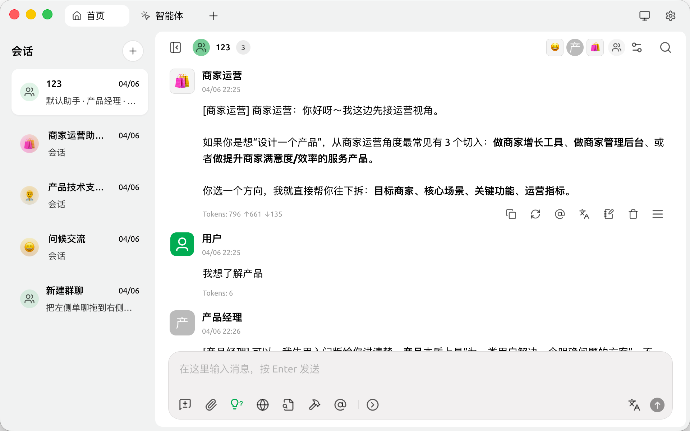
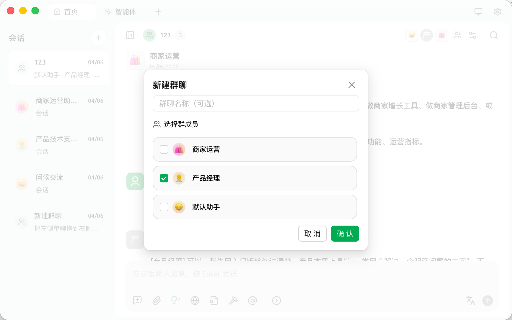

<h1 align="center">
  <a href="https://github.com/lyston11/cherry-studio-GroupChat">
     
  </a>
</h1>

English | <a href="./docs/zh/README.md">中文</a>

# 🍒 Cherry Studio Group Chat Edition

Cherry Studio Group Chat Edition is a desktop client focused on multi-agent group chat experiences. It keeps Cherry Studio's multi-provider desktop foundation and extends it with chatroom-style team conversations.

> Based on [CherryHQ/cherry-studio](https://github.com/CherryHQ/cherry-studio).
>
> This repository is a modified distribution and continues to follow `AGPL-3.0`. Original copyright notices and the license text are preserved in [LICENSE](./LICENSE).

# 🌠 Screenshot

# 🌟 Key Features

1. **Diverse LLM Provider Support**:

- ☁️ Major LLM Cloud Services: OpenAI, Gemini, Anthropic, and more
- 🔗 AI Web Service Integration: Claude, Perplexity, [Poe](https://poe.com/), and others
- 💻 Local Model Support with Ollama, LM Studio

2. **AI Assistants & Conversations**:

- 📚 300+ Pre-configured AI Assistants
- 🤖 Custom Assistant Creation
- 💬 Multi-model Simultaneous Conversations

3. **Document & Data Processing**:

- 📄 Supports Text, Images, Office, PDF, and more
- ☁️ WebDAV File Management and Backup
- 📊 Mermaid Chart Visualization
- 💻 Code Syntax Highlighting

4. **Practical Tools Integration**:

- 🔍 Global Search Functionality
- 📝 Topic Management System
- 🔤 AI-powered Translation
- 🎯 Drag-and-drop Sorting
- 🔌 Mini Program Support
- ⚙️ MCP(Model Context Protocol) Server

5. **Enhanced User Experience**:

- 🖥️ Cross-platform Support for Windows, Mac, and Linux
- 📦 Ready to Use - No Environment Setup Required
- 🎨 Light/Dark Themes and Transparent Window
- 📝 Complete Markdown Rendering
- 🤲 Easy Content Sharing

# 📝 Roadmap

We're actively working on the following features and improvements:

1. 🎯 **Core Features**

- Selection Assistant with smart content selection enhancement
- Deep Research with advanced research capabilities
- Memory System with global context awareness
- Document Preprocessing with improved document handling
- MCP Marketplace for Model Context Protocol ecosystem

2. 🗂 **Knowledge Management**

- Notes and Collections
- Dynamic Canvas visualization
- OCR capabilities
- TTS (Text-to-Speech) support

3. 📱 **Platform Support**

- HarmonyOS Edition (PC)
- Android App (Phase 1)
- iOS App (Phase 1)
- Multi-Window support
- Window Pinning functionality
- Intel AI PC (Core Ultra) Support

4. 🔌 **Advanced Features**

- Plugin System
- ASR (Automatic Speech Recognition)
- Assistant and Topic Interaction Refactoring

# 🌈 Theme

- Theme Gallery: <https://cherrycss.com>
- Aero Theme: <https://github.com/hakadao/CherryStudio-Aero>
- PaperMaterial Theme: <https://github.com/rainoffallingstar/CherryStudio-PaperMaterial>
- Claude dynamic-style: <https://github.com/bjl101501/CherryStudio-Claudestyle-dynamic>
- Maple Neon Theme: <https://github.com/BoningtonChen/CherryStudio_themes>

Welcome PR for more themes

# 🤝 Contributing

We welcome contributions to Group Chat Edition! Here are some ways you can contribute:

1. **Contribute Code**: Develop new features or optimize existing code.
2. **Fix Bugs**: Submit fixes for any bugs you find.
3. **Maintain Issues**: Help manage GitHub issues.
4. **Product Design**: Participate in design discussions.
5. **Write Documentation**: Improve user manuals and guides.
6. **Community Engagement**: Join discussions and help users.
7. **Promote Usage**: Spread the word about Group Chat Edition.

Refer to the [Branching Strategy](docs/en/guides/branching-strategy.md) for contribution guidelines

## Getting Started

1. **Fork the Repository**: Fork and clone it to your local machine.
2. **Create a Branch**: For your changes.
3. **Submit Changes**: Commit and push your changes.
4. **Open a Pull Request**: Describe your changes and reasons.

For more detailed guidelines, please refer to our [Contributing Guide](CONTRIBUTING.md).

# 📜 License

This repository remains under [AGPL-3.0](https://www.gnu.org/licenses/agpl-3.0.html). If you redistribute or modify it, please retain the original license and copyright notices.
